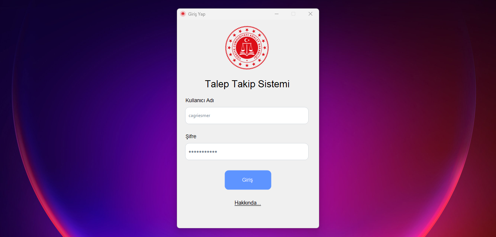
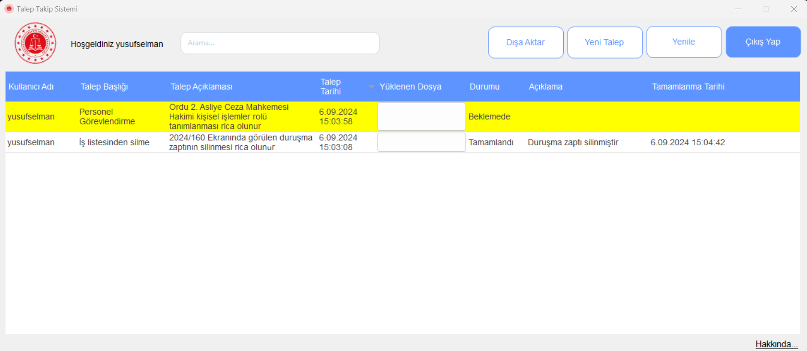
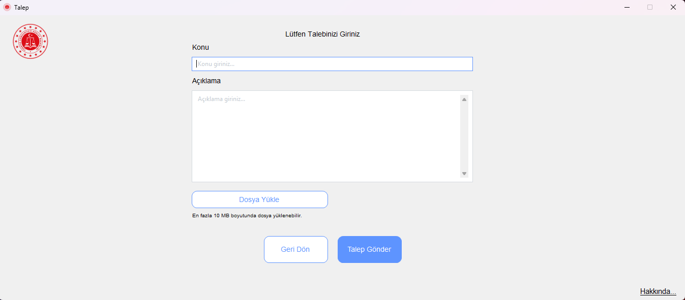
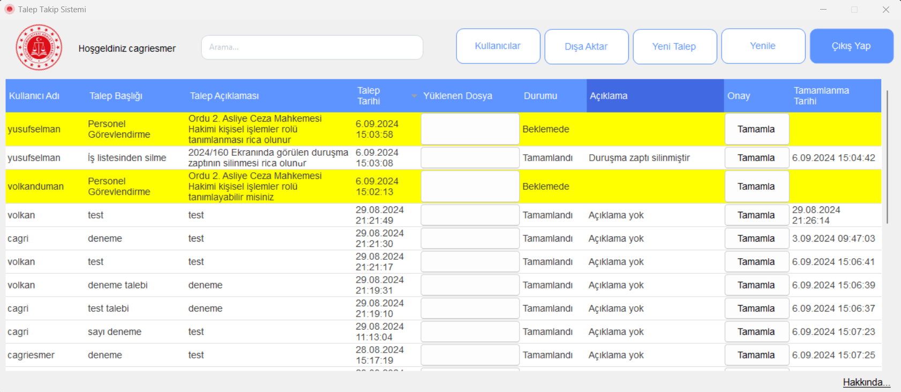
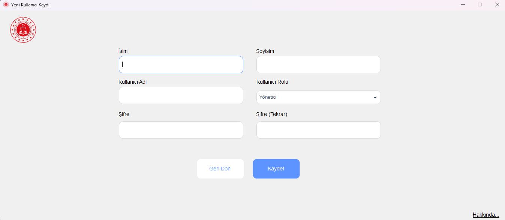
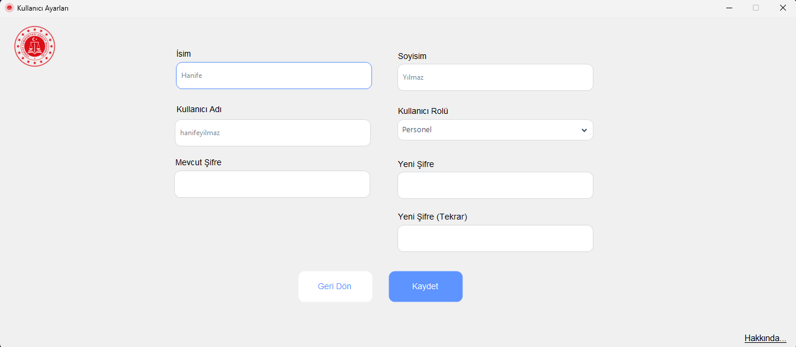
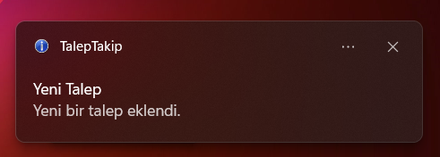

# Talep Takip Sistemi
Bu proje, Windows Forms kullanılarak C# dilinde geliştirilmiş bir Talep Takip Sistemi uygulamasıdır. Telefonla iletilen talep, rica veya isteklerin kaydının tutulamaması nedeniyle bu programa ihtiyaç duyulmuştur. Program kurumdaki ortak sunucuda bulunan MySQL veritabanına yerel ağ üzerinden bağlanarak diğer kullanıcılar tarafından kullanılabilmektedir.

## 🔹 Özellikler
- Program içerisinde "Personel" ve "Yönetici" rolleri bulunmaktadır. Bu rollere göre programda yapılabilecek işlemler değişmektedir.
  ### Personel:
- Program üzerinden yeni talep iletebilir
- Mevcut taleplerinin durumunu görüntüleyebilir.
- Teleplerini Excel dosyası olarak dışarı aktarabilir.
  ### Yönetici:
- Programda tüm talepleri görüntüleyebilir, bir talebi silebilir, veya "Tamamla" butonu ile tamamlayabilir.
- Tamamlama işlemi esnasında açıklama girebilir.
- Kullanıcı listesini görüntüleyebilir. Yeni kullanıcı ekleyebilir, mevcut bir kullanıcıyı düzenleyebilir ya da silebilir.
- Personel için tanımlanan işlemlerin hepsini yönetici de yapabilir.
- Yeni bir talep geldiğinde yöneticiye bildirim iletilir.

## 🔧 Kurulum
1. Projeyi GitHub'dan veya ZIP olarak indirin.
2. Visual Studio'da TalepTakip.sln dosyasını açın.
3. Gerekli NuGet paketlerini ekleyin.
4. İstediğiniz veritabanına App.config dosyası içindeki connection string ile bağlantısını yapın.
5. Projeyi derleyin ve çalıştırın.

Projede .NET Framework 4.7.2 kullanılmıştır. Ayrıca 4.8 sürümü ile de uyumlu çalışabilir.

## 💻 Kullanılan Teknolojiler
- Visual Studio 2022
- .NET Framework 4.5
- MySQL veritabanı, şu tablolar ile: requests, roles, states ve users.

## 📦 Bağımlılıklar
- **NuGet Paketleri:**
  - Guna.UI2.WinForms: Gelişmiş UI bileşenleri için.
  - BouncyCastle.Cryptography: Kriptografik fonksiyonlar için.
  - MySql.Data: MySQL veritabanı ile etkileşim için.

## 📸 Ekran Görüntüleri
- Giriş ekranı

- Personel ana sayfa (Listelenen talepler örnektir.)

- Talep girişi

- Yönetici ana sayfa (Listelenen talepler örnektir.)

- Kullanıcı ekleme

- Kullanıcı düzenleme

- Kullanıcı listesi

- Yeni talep bildirimi

## 📧 İletişim
cagriesmer7@gmail.com
